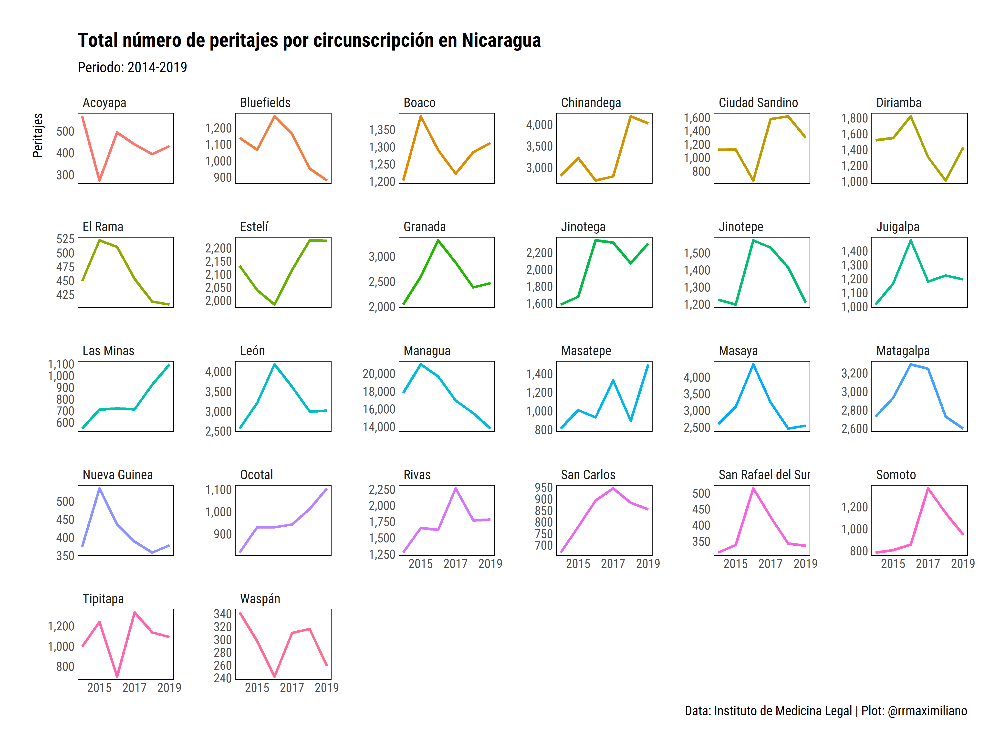

<!-- README.md is generated from README.Rmd. Please edit that file -->

```{r, include = FALSE}
knitr::opts_chunk$set(
  collapse = TRUE,
  comment = "#>",
  fig.path = "man/figures/README-",
  out.width = "100%"
)
```

# Estadísticas del Instituto de Medicina Legal de Nicaragua

```{r, include = FALSE}
library(tidyverse)

# Read data ---------------------------------------------------------------
project <- file.path("D:/Documents/GitHub/iml_nicaragua")
data    <- file.path(project, "data")

iml <- read_rds(file.path(data, "iml.rds"))
```

Este repositorio contiene datos extraídos de los reportes de los anuarios estadísticos del Instituto de Medicina Legal de Nicaragua. Los datos se encuentran en la subcarpeta `data` en formato `csv` y `rds`.

Las variables en esta base son: 

* `year`: año
* `circuncripción`: Circunscripción
* `tipología`: Tipología de la violencia
* `casos`: Total de casos

```{r}
iml
```

```{r, echo = FALSE}

```


## Comentarios y sugerencias

Para realizar comentarios o sugerencias sobre la base de datos puedes abrir un issue en este repositorio: [https://github.com/RRMaximiliano/iml_nicaragua/issues](https://github.com/RRMaximiliano/iml_nicaragua/issues)