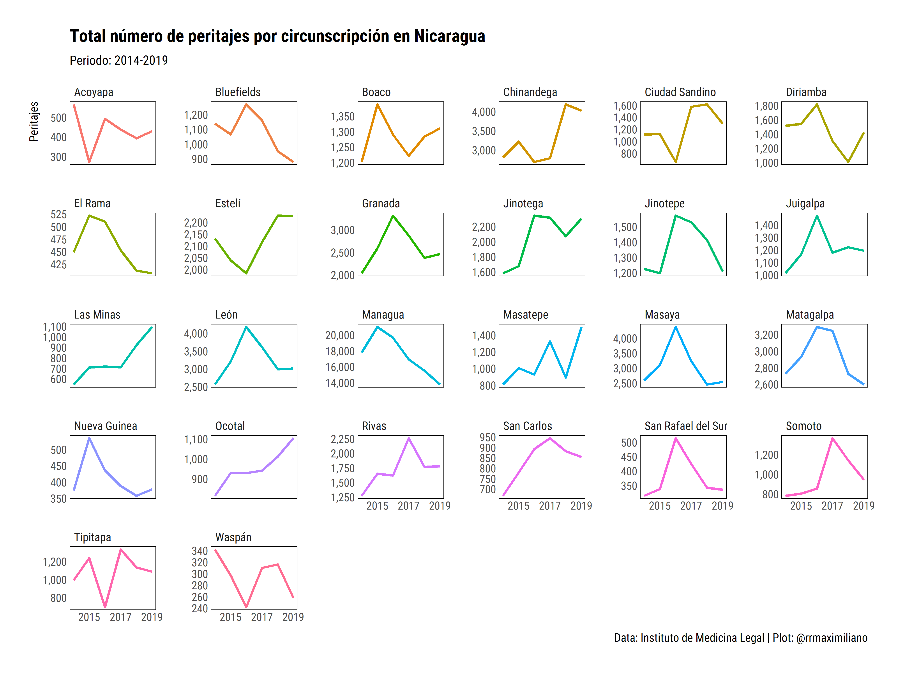

<!-- README.md is generated from README.Rmd. Please edit that file -->

# Estadísticas del Instituto de Medicina Legal de Nicaragua

Este repositorio contiene datos extraídos de los reportes de los
anuarios estadísticos del Instituto de Medicina Legal de Nicaragua. Los
datos se encuentran en la subcarpeta `data` en formato `csv` y `rds`.

Las variables en esta base son:

-   `year`: año
-   `circuncripción`: Circunscripción
-   `tipología`: Tipología de la violencia
-   `casos`: Total de casos

``` r
iml
#> # A tibble: 855 x 4
#>     year circunscripcion tipologia                      casos
#>    <dbl> <chr>           <chr>                          <dbl>
#>  1  2014 Acoyapa         lesiones fisicas                 172
#>  2  2014 Acoyapa         lesiones psiquicas               215
#>  3  2014 Acoyapa         violencia dentro de la familia    70
#>  4  2014 Acoyapa         violencia sexual                  80
#>  5  2014 Acoyapa         peritacion tanatologica           29
#>  6  2014 Bilwi           lesiones fisicas                 802
#>  7  2014 Bilwi           lesiones psiquicas               312
#>  8  2014 Bilwi           violencia dentro de la familia   326
#>  9  2014 Bilwi           violencia sexual                 148
#> 10  2014 Bilwi           peritacion tanatologica           43
#> # ... with 845 more rows
```



## Comentarios y sugerencias

Para realizar comentarios o sugerencias sobre la base de datos puedes
abrir un issue en este repositorio:
<https://github.com/RRMaximiliano/iml_nicaragua/issues>
